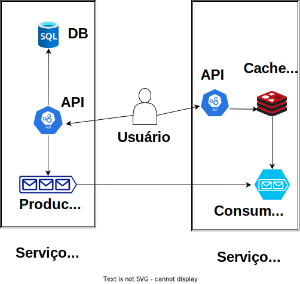
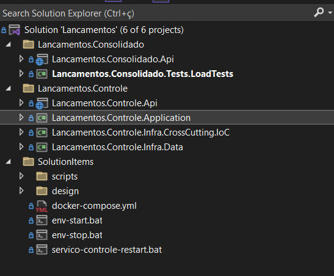
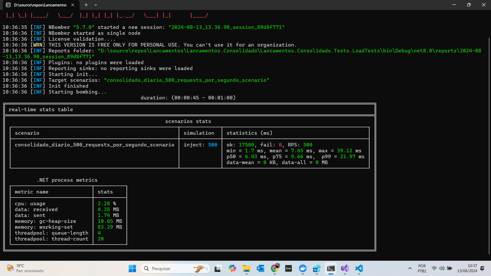

# Lançamentos

## Desenho da solução

A solução desenvolvida contempla os seguintes componentes:

### Serviço para Controle de Lançamentos
- API NET 8: possui um endpoint para gravar no banco de dados SQL Server e disparar um evento de atualização do Serviço de Consolidado Diário via fila
- Banco de dados SQL Server: armazena todos os lançamentos diários
- RabbitMQ Producer: consolida os saldos diários e envia uma mensagem para a fila solicitando a atualização do cache Redis (evento disparado via MediatR)

### Serviço de Consolidado Diário
- API NET 8: possui um endpoint para ler o saldo de um dia específico
- RabbitMQ Consumer: lê as mensagens da fila no RabbitMQ (via BackgroundService)
- Cache Redis: armazena todos os saldos diários

## Estrutura projeto (Visual Studio)

## Instruções para execução da aplicação

Pré-requisitos:
- Docker e Docker Compose instalados

Basta executar os arquivos .bat abaixo para testar todos os cenários da solução:
- [Iniciar aplicação](SolutionItems/env-start.bat)
- [Parar aplicação](SolutionItems/env-stop.bat)
- [Parar Serviço para Controle de Lançamentos](SolutionItems/servico-controle-stop.bat)
- [Reiniciar Serviço para Controle de Lançamentos](SolutionItems/servico-controle-restart.bat)

Teste de carga:
- Executar a class libray Lancamentos.Consolidado.Tests.LoadTests
 

